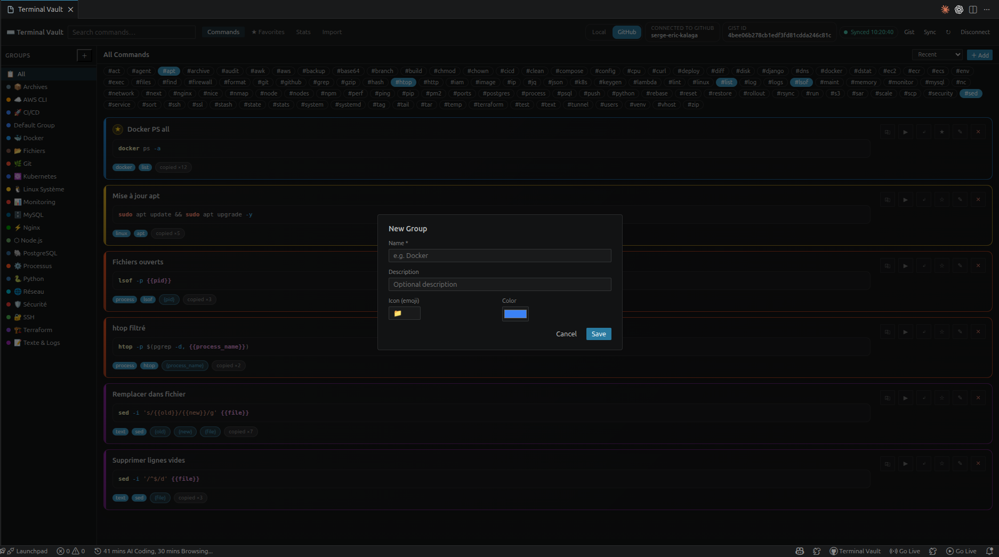
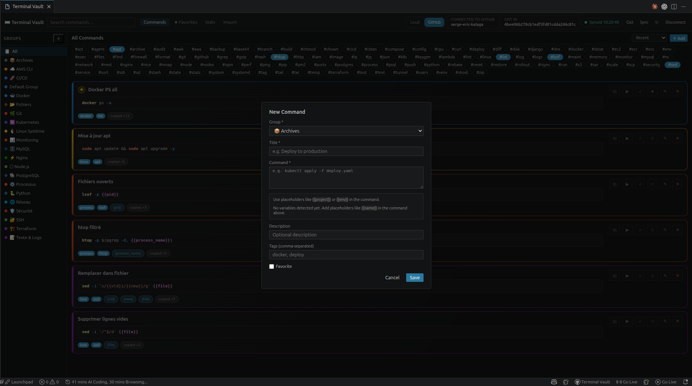
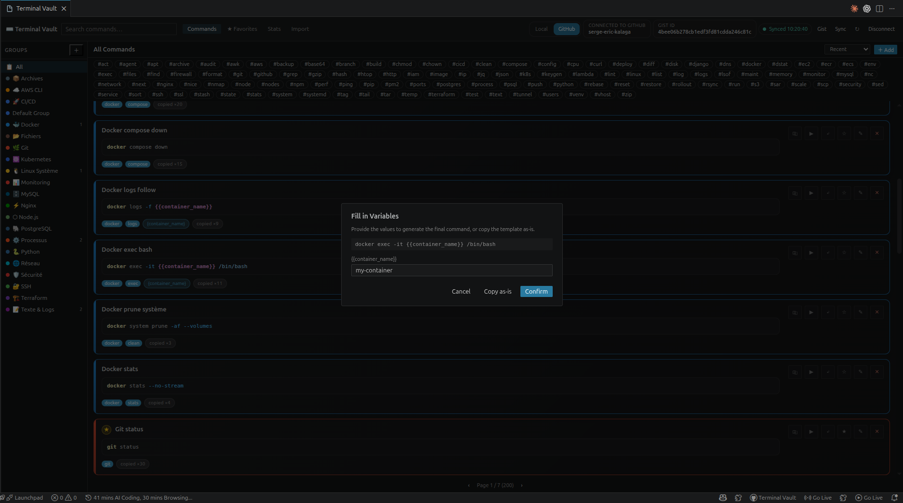
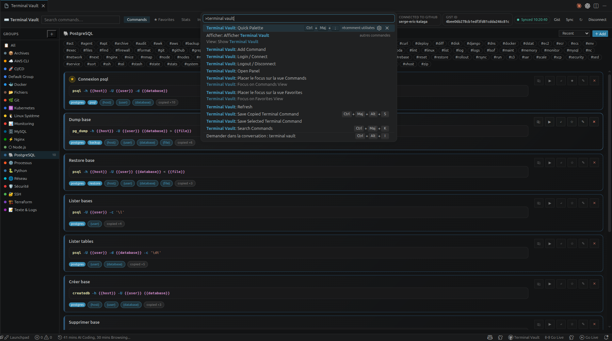

# ⌨️ Terminal Vault

Save, organize, search, and reuse your terminal commands directly inside VS Code.

Terminal Vault helps you build your own command library without leaving your editor. Keep your favorite shell commands, organize them by group, add variables, and reuse them in one click.

## 🎬 Demo

<video src="https://raw.githubusercontent.com/serge-eric-kalaga/TerminalVault-GithubExtension/main/images/demo.mp4" controls width="100%"></video>

---

## 🖼️ Screenshots

### Panel principal


Groupes à gauche, commandes au centre avec tags et variables. Synchronisation GitHub Gist visible dans la barre du haut.

### Créer un groupe



Choisissez un nom, une icône et une couleur pour organiser vos commandes.

### Ajouter une commande



Saisissez le titre, la commande, une description, des tags, et définissez des variables avec `{{ma_variable}}`.

### Remplir les variables



Avant chaque copie ou exécution, Terminal Vault détecte automatiquement les variables et propose un formulaire pour les remplir.

### Palette de commandes & raccourcis



Accédez à toutes les actions Terminal Vault depuis la palette de commandes VS Code.

---

## ✨ Fonctionnalités

- 📁 **Groupes** — organisez vos commandes par thème, avec icône et couleur personnalisées
- ⭐ **Favoris** — marquez et retrouvez vos commandes les plus importantes
- 🏷️ **Tags** — filtrez rapidement par un ou plusieurs tags (filtre OU)
- 🔎 **Recherche rapide** — palette de commandes pour chercher et réutiliser en un instant
- 🧩 **Variables dynamiques** — définissez `{{container}}`, `{{env}}`, etc. avec valeurs par défaut
- 📋 **Copier** — copie en un clic, avec remplissage des variables ou en brut
- ▶️ **Exécuter** — lance directement dans le terminal intégré
- ✍️ **Insérer** — insère la commande à la position du curseur
- 🖱️ **Sauvegarder depuis le terminal** — sélectionnez du texte dans le terminal, clic droit, sauvegardé
- 📥 **Import historique shell** — collez votre historique bash/zsh, prévisualisez et importez les commandes utiles
- ☁️ **GitHub Gist sync** — synchronisez vos commandes entre machines, avec création automatique du Gist si inexistant
- 🔄 **Sync automatique** — chaque ajout, modification ou suppression déclenche une synchronisation immédiate

---

## 🚀 Pourquoi Terminal Vault ?

Fini de chercher dans vos notes, votre historique shell, vos messages Slack ou vos fichiers éparpillés. Vos meilleures commandes sont là où vous travaillez : dans VS Code.

Idéal pour :
- commandes Docker et Docker Compose
- workflows Git
- scripts de déploiement
- maintenance serveur (SSH, nginx, systemd…)
- utilitaires base de données (PostgreSQL, MySQL…)
- tâches de dev local répétitives
- snippets de debugging

---

## 🧭 Prise en main

### 1. Ouvrir le panel

Depuis la barre d'activité ou via la commande :
```
Terminal Vault: Open Panel
```

### 2. Créer un groupe

Cliquez sur **+** dans la colonne des groupes. Donnez-lui un nom, une icône et une couleur.

### 3. Ajouter une commande

Cliquez sur **+ Add** en haut à droite du panel ou utilisez :
```
Terminal Vault: Add Command
```

Vous pouvez aussi :
- sélectionner du texte dans le terminal → clic droit → `Terminal Vault: Save Selected Terminal Command`
- copier une commande → `Terminal Vault: Save Copied Terminal Command`
- importer depuis l'historique shell via l'onglet **Import**

### 4. Réutiliser à tout moment

Pour chaque commande :

| Action | Description |
|--------|-------------|
| 📋 Copier | Copie avec remplissage des variables |
| ▶️ Exécuter | Lance dans le terminal intégré |
| ✍️ Insérer | Insère à la position du curseur |
| ⭐ Favori | Marque la commande |
| ✏️ Éditer | Modifie la commande |
| ❌ Supprimer | Supprime la commande |

---

## 🧩 Variables dans les commandes

Définissez des commandes dynamiques avec des variables entre doubles accolades :

```sh
docker logs {{container}} --tail {{lines}}
kubectl apply -f {{file}} -n {{namespace}}
ssh -i {{key}} {{user}}@{{host}}
```

Quand vous copiez ou exécutez :
- Terminal Vault détecte les variables automatiquement
- Un formulaire apparaît pour les remplir
- Vous pouvez définir des valeurs par défaut à la création
- **Copy as-is** copie le template brut sans substitution

---

## ☁️ Synchronisation GitHub Gist

Activez le mode **GitHub Gist** pour synchroniser vos commandes entre plusieurs machines.

- Connexion via GitHub OAuth (aucun token à gérer)
- Création automatique du Gist secret si inexistant
- Sync automatique après chaque modification
- Fusion intelligente en cas de conflit local/distant
- Statut de synchronisation visible en temps réel dans le panel

---

## ⌨️ Raccourcis clavier

| Raccourci | Action |
|-----------|--------|
| `Ctrl+Shift+;` / `Cmd+Shift+;` | Palette rapide |
| `Ctrl+Shift+K` / `Cmd+Shift+K` | Recherche de commandes |
| `Ctrl+Shift+Alt+S` / `Cmd+Shift+Alt+S` | Sauvegarder la commande copiée |

---

## 🛠️ Commandes disponibles

- `Terminal Vault: Open Panel`
- `Terminal Vault: Quick Palette`
- `Terminal Vault: Search Commands`
- `Terminal Vault: Add Command`
- `Terminal Vault: Save Copied Terminal Command`
- `Terminal Vault: Save Selected Terminal Command`
- `Terminal Vault: Login / Connect`
- `Terminal Vault: Logout / Disconnect`
- `Terminal Vault: Refresh`

---

## ⚙️ Paramètres

| Paramètre | Description |
|-----------|-------------|
| `terminalVault.storageMode` | Mode de stockage : `local` ou `github-gist` |
| `terminalVault.githubGistId` | ID du Gist GitHub utilisé pour la synchronisation |

---

## 🔐 Prérequis

- **Mode local** : aucun compte requis, commandes stockées dans le stockage global VS Code.
- **Mode GitHub Gist** : connexion GitHub depuis VS Code, autorisation de l'accès Gist uniquement.

---

## 📝 Notes de version

### 0.1.0

Première version avec :

- 📁 groupes avec icône et couleur
- ⭐ favoris
- 🏷️ tags et filtre multi-tags (OU logique)
- 🔎 palette de recherche rapide
- 🧩 variables dynamiques avec valeurs par défaut
- 📋 copier / ▶️ exécuter / ✍️ insérer
- 🖱️ sauvegarde depuis la sélection terminal
- 📥 import de l'historique shell
- ☁️ stockage local et synchronisation GitHub Gist automatique
- 🗑️ suppression de groupe avec protection du groupe par défaut
