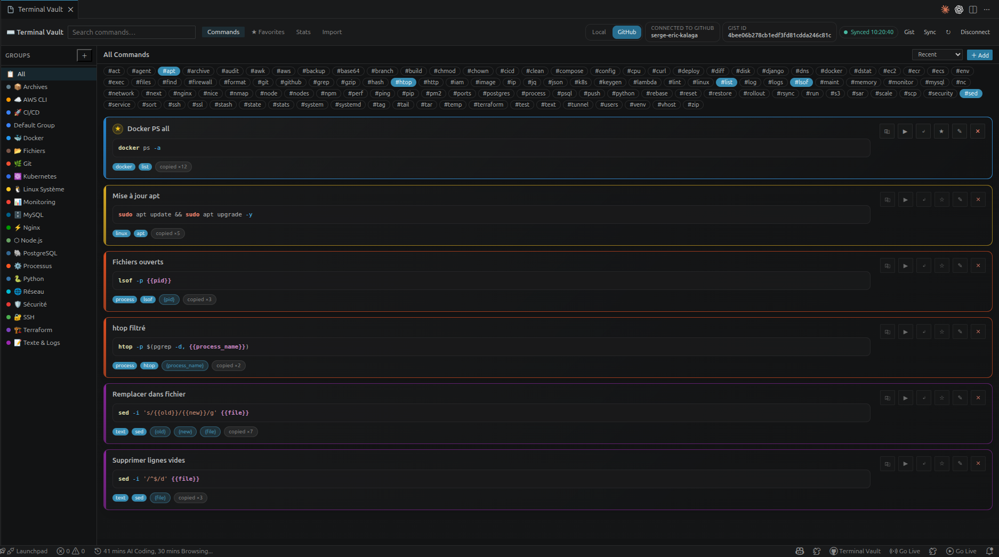

# ⌨️ Terminal Vault

Save, organize, search, and reuse your terminal commands directly inside VS Code.

Terminal Vault helps you build your own command library without leaving your editor. Keep your favorite shell commands, organize them by group, add variables, and reuse them in one click.

## ✨ What You Can Do

With Terminal Vault, you can:

- 📁 organize commands into groups with custom colors and icons
- ⭐ mark your favorite commands
- 🏷️ add tags for faster filtering
- 🔎 search commands from a quick palette
- 📋 copy a command instantly
- ▶️ run a command in the integrated terminal
- ✍️ insert a command at the cursor
- 🧩 define commands with variables like `{{project}}` or `{{env}}`
- 📝 fill variables before copying or running
- 📎 copy the raw command template as-is
- 🖱️ save a command directly from terminal selection
- 📥 import useful commands from your shell history
- ☁️ store commands locally or sync them with GitHub Gist

## 🚀 Why Terminal Vault?

Instead of searching old notes, shell history, chat messages, or random files, you keep your best commands where you actually work: inside VS Code.

Perfect for:

- Docker commands
- Git workflows
- deployment scripts
- server maintenance commands
- database utilities
- repeated local dev tasks
- debugging snippets

## 🖼️ Screenshots

Add your screenshots here:





### Screenshot Placeholders

```md

```

```md

```

```md

```

```md

```

## 🎬 GIF Demos

Add animated demos here:

```md


```

### GIF Placeholders

```md

```

```md

```

```md

```

## 📦 Main Features

### 📁 Groups

Create groups to organize your commands by topic.

Examples:
- `Docker`
- `Git`
- `Server`
- `Deployment`
- `Database`

Each group can have:
- a name
- an icon
- a color
- an optional description

### 🧩 Variables in Commands

You can save dynamic commands using placeholders.

Example:

```sh
docker logs {{container}} --tail {{lines}}
```

When you use a command with variables:
- Terminal Vault detects the variables automatically
- a small form appears before execution or copy
- you can set default values
- you can also copy the original template without replacing variables

### 🖱️ Save Commands From the Terminal

Terminal Vault makes it easy to save commands while working in the terminal.

You can:

1. select text in the integrated terminal
2. right-click
3. choose `Terminal Vault: Save Selected Terminal Command`

You can also:

1. copy a command manually
2. run `Terminal Vault: Save Copied Terminal Command`

### 🔎 Quick Search

Use the quick palette to search and reuse commands quickly.

You can:
- search by title
- search by command text
- search by tags
- open top copied commands fast

### 📥 Import Shell History

Paste your shell history and import the useful commands into a group.

The importer helps you:
- preview commands before saving
- skip duplicates
- ignore noisy entries
- apply tags to imported commands

### ☁️ Storage Options

Terminal Vault supports:

- `local` storage
- `github-gist` storage

Use local mode for simplicity, or GitHub Gist mode if you want sync across machines.

## 🧭 How To Use

### 1. Open the panel

Open the Terminal Vault panel from the activity bar or run:

- `Terminal Vault: Open Panel`

### 2. Create a group

Create a group like `Docker`, `Git`, or `DevOps`.

### 3. Add a command

You can add a command:

- manually
- from copied terminal content
- from selected terminal text
- from shell history import

### 4. Reuse it anytime

For each command, you can:

- 📋 copy it
- ▶️ run it in terminal
- ✍️ insert it in the editor
- ⭐ favorite it
- ✏️ edit it
- ❌ delete it

## 🛠️ Commands

Terminal Vault includes these commands:

- `Terminal Vault: Open Panel`
- `Terminal Vault: Quick Palette`
- `Terminal Vault: Search Commands`
- `Terminal Vault: Add Command`
- `Terminal Vault: Save Copied Terminal Command`
- `Terminal Vault: Save Selected Terminal Command`
- `Terminal Vault: Login / Connect`
- `Terminal Vault: Logout / Disconnect`
- `Terminal Vault: Refresh`

## ⌨️ Keyboard Shortcuts

Default shortcuts:

- `Ctrl+Shift+;` / `Cmd+Shift+;` → Quick Palette
- `Ctrl+Shift+K` / `Cmd+Shift+K` → Search Commands
- `Ctrl+Shift+Alt+S` / `Cmd+Shift+Alt+S` → Save copied terminal command

## ⚙️ Settings

Available settings:

- `terminalVault.storageMode`
  Choose where commands are stored:
  - `local`
  - `github-gist`

- `terminalVault.githubGistId`
  The GitHub Gist ID used when sync is enabled

## 🧠 Example Use Cases

Here are a few command ideas you can store:

```sh
git checkout -b {{branch}}
docker logs {{container}} --tail {{lines}}
kubectl apply -f {{file}}
ssh {{user}}@{{host}}
scp {{file}} {{user}}@{{host}}:{{path}}
```

## 📂 Suggested Asset Structure

```text
images/
  main-panel.png
  command-cards.png
  variable-form.png
  terminal-context-menu.png

gifs/
  create-command.gif
  save-terminal-selection.gif
  copy-with-variables.gif
  import-shell-history.gif
```

## 🔐 Requirements

No external account is required in local mode.

For GitHub sync mode, you just need to sign in with GitHub from VS Code and approve access when prompted.

## 📝 Notes

- In local mode, commands are stored in VS Code global storage.
- In GitHub Gist mode, commands can be synced through a Gist.
- Saving a selected terminal command relies on terminal selection inside VS Code.

## 🎉 Release Notes

### 0.1.0

First release with:

- 📁 groups
- ⭐ favorites
- 🏷️ tags
- 🔎 quick search
- 🧩 variable support
- 📋 copy / run / insert actions
- 🖱️ terminal save actions
- 📥 shell history import
- ☁️ local and GitHub Gist storage
- 🎨 improved command card UI
